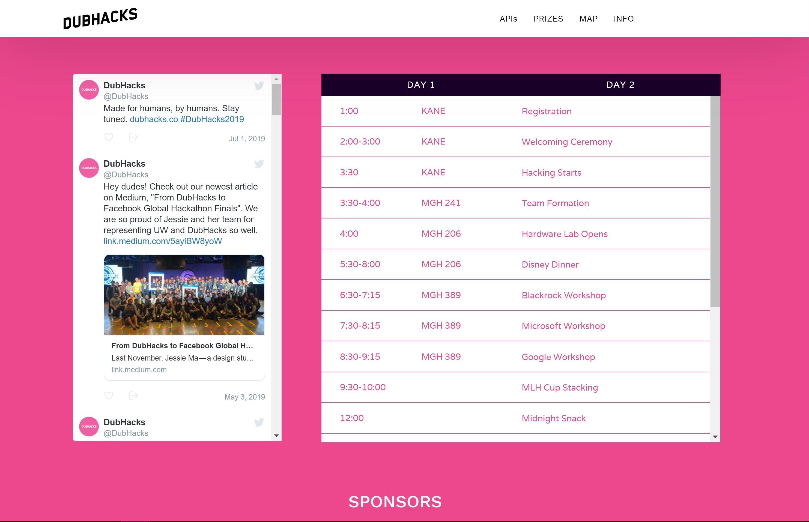
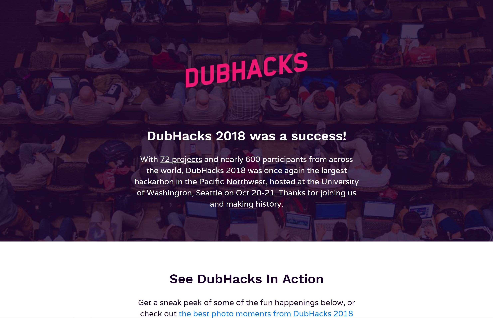

# DubHacks 2018 Tech Projects

The 2018 DubHacks Tech Team worked on multiple web applications and websites for organizing the University of Washington's annual hackathon. 

As the tech team lead, I worked with all members of the organizing team to develop our tech tools and personally worked on our participant application and check-in portal (Quill), judging page (Expo), look back page, and application statistics page.

Below is a list of the tech projects our team worked on throughout 2018 to organize DubHacks:

## Splash Page

DubHacks opens every new hackathon year with a splash page for the event where attendees can sign up to be notified when applications will start to be accepted. Our 2018 page featured multiple design assets and four unique color themes, one of which would be presented at random to participants.

## Quill

Quill is a web application originally built by the HackMIT team, and can be accessed [here](https://github.com/techx/quill). DubHacks maintains its own version of Quill for participants to submit applications, for admins to approve applications and travel reimbursements, and for volunteers to check in participants at the event.  

## Live Page

Our 2018 Live Page featured information for participants to reference during the hackathon like the schedule of events, technical resources like sponsor companies' APIs, and prizes.

## Gavel

[Gavel](https://github.com/anishathalye/gavel), another tool produced by the HackMIT team, was used by our judges to determine winners of our prizes this year. The tool uses pairwise comparisions for judges to choose the best projects. 

## Expo

To help judges find where teams were located and what prizes they were competing for, we utilized [Expo](https://github.com/nealrs/expo), a tool for exported data from [DevPost](https://devpost.com/) to be shown in an easily searchable HTML page.

## Look Back Page

At the end of DubHacks 2018, we created a look back page with highlights from the event and a thank you message to our sponsors. 

## DubHacks Stats

The DubHacks Stats page was a new project in 2018, which involved collecting and analyzing application data from 2015-2018 DubHacks events and formatting them in an HTML page for participants and sponsors to view. I wanted to showcase this data in support of being able to talk about diversity at hackathons and in the tech industry in a transparent, data-supported way. We hope that the project can prompt similar conversations and openness across the hacker community.  

